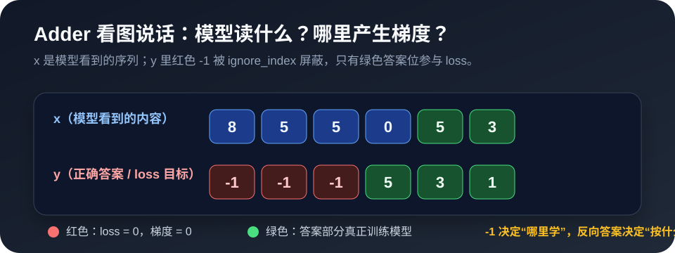
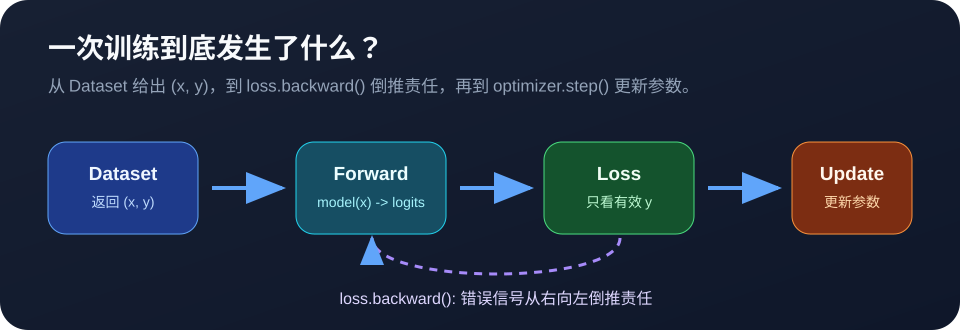
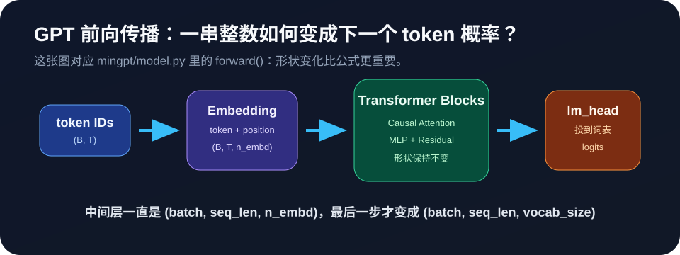

# minGPT 中文可执行学习书

这是一个把 Karpathy 的 [minGPT](https://github.com/karpathy/minGPT) 改造成中文学习材料的仓库。

核心不是“又一个 GPT 代码仓库”，而是一份可以边读、边看图、边运行 Notebook 的学习书：

```text
docs/learning_guide.html
```

## 先看三张图

这三张图是 HTML 里的核心学习方式：先看图，把概念看懂，再运行 Notebook。

### Adder：哪里会产生梯度？



### 一次训练：从 Dataset 到参数更新



### GPT 前向传播：从 token IDs 到 logits



这份 HTML 是本仓库的主角。它把 minGPT 里最容易卡住的概念拆成三件事：

1. **看图说话**：先用图理解数据流、mask、attention、loss、训练循环。
2. **运行代码**：再到 `learning_guide.ipynb` 里执行对应 cell。
3. **回到源码**：最后对照 `mingpt/model.py`、`trainer.py`、`projects/adder/adder.py` 看真实实现。

## 为什么做这本书

很多 GPT 教程会直接跳到 Transformer 公式，但初学者真正困惑的地方通常更基础：

- 为什么 Dataset 要返回 `(x, y)`？
- `x` 和 `y` 到底差在哪一格？
- adder 项目里为什么答案要反着写？
- `-1` 为什么能让某些位置不产生 loss？
- 模型到底“看到了什么”，又“在哪些位置被惩罚”？
- attention 的 Q/K/V 到底是在干什么？
- `generate.ipynb` 为什么一运行就下载模型，甚至把硬盘占满？

所以这份学习书的重点不是堆术语，而是把这些问题逐个画出来、跑出来、解释清楚。

## 最值得看的经典部分

### 1. Adder 数据构造与梯度屏蔽：看图说话版

HTML 里最关键的一张图是：

```text
图：Adder 数据构造与梯度屏蔽示意图（看图说话版）
```

它解释了：

- 上方 `x` 是模型真正读到的 token
- 下方 `y` 是模型要预测的 token
- 红色 `-1` 的位置不会产生 loss
- 绿色答案位置才会产生梯度并更新参数
- 反向编码答案和 `-1` loss mask 是两件不同的事

这是理解 `projects/adder/adder.py` 的入口，也是理解“训练到底训练了哪里”的入口。

HTML 正文里还有更完整的逐行解释：为什么真实代码里没有 `+` 和 `=`，为什么 `x` 要丢掉最后一位，为什么 `y` 要先右移再把前面位置设为 `-1`。

### 2. Adder 完整训练一步的数据流

```text
图：Adder 完整训练一步的数据流（看图说话）
```

这张图把一次训练拆成：

```text
Dataset -> model(x) -> logits -> loss -> backward -> optimizer.step()
```

读完这节，再看 `Trainer.run()` 就不会觉得训练循环是黑盒。

这部分特别适合和 `mingpt/trainer.py` 一起看：你会看到训练不是“魔法”，就是反复执行 forward、loss、backward、step。

### 3. 损失地形图与反向传播

HTML 里有两个非常适合建立直觉的部分：

```text
经典可视化：损失地形图（Loss Landscape）
图：反向传播“倒推责任”示意图
```

它们解释：

- loss 为什么像一个地形
- 学习率太大/太小会发生什么
- `loss.backward()` 为什么是在“倒推责任”
- optimizer 为什么能让参数朝更低 loss 的方向移动

### 4. GPT 整体前向传播架构图

```text
图：GPT 整体前向传播架构示意图
```

这张图把 GPT 的主路径串起来：

```text
token IDs
-> token embedding + position embedding
-> n_layer 个 Transformer Block
-> LayerNorm
-> lm_head
-> logits
```

它适合和 `mingpt/model.py` 的 `forward()` 函数一起看。

如果你只想抓住 GPT 的主干，先记住这一句话：中间层一直保持 `(B, T, n_embd)`，最后 `lm_head` 才把它变成 `(B, T, vocab_size)`。

### 5. 自注意力机制与交互式注意力小工具

HTML 中 attention 部分从直觉开始：

- Query：我想找什么信息？
- Key：我这里有什么信息？
- Value：如果你关注我，我能提供什么？

然后再进入：

```text
Attention(Q, K, V) = softmax(QK^T / sqrt(d_k)) V
```

还有一个交互式注意力小工具，可以逐步看：

```text
QK^T -> causal mask -> softmax -> weighted V
```

### 6. 生成、预训练权重与磁盘提醒

`generate.ipynb` 已经改成安全版：

```python
model_type = 'gpt2'
allow_large_models = False
```

它会阻止你不小心下载 `gpt2-xl` 这种数 GB 的大模型。学习生成流程时，用 `gpt2` 就够了。

## 怎么打开这本书

最简单方式：

1. 下载或 clone 仓库
2. 用浏览器打开 `docs/learning_guide.html`
3. 用 Jupyter 打开 `learning_guide.ipynb`
4. HTML 负责阅读和看图，Notebook 负责运行代码

如果你在本地仓库根目录：

```powershell
start .\docs\learning_guide.html
jupyter notebook .\learning_guide.ipynb
```

英文版在：

```text
docs/learning_guide_en.html
```

## 仓库结构

```text
docs/
├── learning_guide.html       # 中文 HTML 学习书，主入口
├── learning_guide.css        # HTML 样式
├── learning_guide.js         # 交互式图表与复制代码功能
├── learning_guide_en.html    # 英文版
├── check_lang.py             # 文档检查辅助脚本
└── translate_sections.py     # 翻译/同步辅助脚本

learning_guide.ipynb          # 配合 HTML 运行的练习 Notebook
generate.ipynb                # 安全版 GPT-2 生成示例
demo.ipynb                    # minGPT 原 demo 的学习版
run_notebook.py               # Notebook 运行辅助脚本

mingpt/
├── model.py                  # Transformer/GPT 主体，已加入大量教学注释
├── bpe.py                    # GPT-2 BPE tokenizer
├── trainer.py                # 训练循环
└── utils.py                  # 配置与工具函数

projects/
├── adder/                    # GPT 学加法，重点看数据构造和 loss mask
└── chargpt/                  # 字符级语言模型
```

## 环境准备

建议 Python 3.10+。

只学习小模型训练：

```bash
pip install torch numpy
pip install -e .
```

如果要运行 `generate.ipynb` 加载 GPT-2：

```bash
pip install transformers
```

## 推荐阅读顺序

1. `docs/learning_guide.html`
2. `learning_guide.ipynb`
3. `projects/adder/adder.py`
4. `mingpt/model.py`
5. `mingpt/trainer.py`
6. `generate.ipynb`

## 这个版本改了什么

- 增加中文 HTML 可执行学习书
- 增加配套练习 Notebook
- 给 minGPT 核心源码加入中文教学注释
- 重写 Dataset、Adder、attention、训练循环等解释
- 修正 BPE token ID、gpt-nano head 数、RoPE 示例、Chinchilla scaling law 等容易误导的内容
- 给 `generate.ipynb` 加入大模型下载保护
- README 改成面向这份中文学习书的项目说明

## 轻量检查

```bash
python -m json.tool learning_guide.ipynb
python -m json.tool generate.ipynb
node --check docs/learning_guide.js
```

原始测试：

```bash
python -m unittest discover tests
```

注意：部分测试可能涉及 Hugging Face GPT-2 权重加载，可能触发模型下载。

## 上游项目

原始 minGPT：

```text
https://github.com/karpathy/minGPT
```

本仓库是个人学习注释版，重点是中文图解、Notebook 实验和可读源码。

## License

MIT
