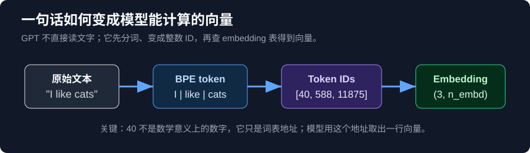
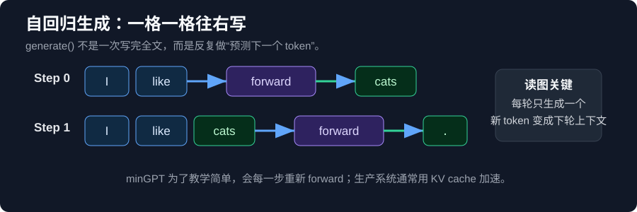

<p align="center">
  
</p>

<h1 align="center">minGPT 中文可执行学习书</h1>

<p align="center">
  从 Karpathy 的 minGPT 出发，用中文图解、Notebook 实验和源码注释，把 GPT 从 Dataset 到 Attention、训练、生成、Agent Loop 一次讲透。
</p>

<p align="center">
  <a href="https://htmlpreview.github.io/?https://github.com/zixuniaowu/mingpt-learning-guide/blob/main/docs/learning_guide.html"><b>在线预览 HTML</b></a>
  ·
  <a href="docs/learning_guide.html"><b>本地 HTML 文件</b></a>
  ·
  <a href="learning_guide.ipynb"><b>运行 Notebook</b></a>
  ·
  <a href="projects/adder/adder.py"><b>研究 Adder</b></a>
  ·
  <a href="mingpt/model.py"><b>读 GPT 源码</b></a>
</p>

<p align="center">
  
  
  
  
</p>

---

## 这不是“又一个 minGPT fork”

原始 [minGPT](https://github.com/karpathy/minGPT) 是一个极简、干净、教育导向的 GPT 实现。这个仓库把它改造成一本可以边读边运行的中文学习书：

```text
HTML 书页 -> Notebook 实验台 -> minGPT 源码
```

你先在 HTML 里看图建立直觉，再到 Notebook 里运行真实代码，最后回到 `mingpt/model.py`、`mingpt/trainer.py` 和 `projects/adder/adder.py` 验证实现。

## 一眼看懂它好在哪里

| 你通常卡住的地方 | 这本书怎么解决 |
| --- | --- |
| `Dataset` 为什么返回 `(x, y)`？ | 用 Adder 的 token 表格和 loss mask 图直接画出来 |
| `-1` 为什么不参与 loss？ | 红色屏蔽区 / 绿色梯度区分开解释 |
| Attention 的 Q/K/V 太抽象 | 从“我想找什么 / 我有什么 / 我能提供什么”讲到公式 |
| `generate()` 为什么一格一格生成？ | 用自回归循环图解释每一步如何追加 token |
| GPT 源码看不进去 | 先看 `(B, T, C)` 数据流，再逐行对照 `forward()` |
| Coding Agent 和 GPT 有什么关系？ | 把 Codex、Claude Code、Loop Engineering 放回“下一个 token + 工具反馈循环” |

## 最值得先看的 6 张图

| Adder 梯度屏蔽 | 一次训练循环 |
| --- | --- |
|  |  |

| GPT 前向传播 | Tokenization 到 Embedding |
| --- | --- |
|  |  |

| 自回归生成 | 从 HTML 到 Notebook |
| --- | --- |
|  | <b>HTML 负责理解，Notebook 负责执行，源码负责验证。</b><br><br>这就是这本书的核心学习方式。 |

## 快速开始

```bash
git clone https://github.com/zixuniaowu/mingpt-learning-guide.git
cd mingpt-learning-guide

pip install torch numpy
pip install -e .
```

打开中文学习书：

```powershell
start .\docs\learning_guide.html
```

打开配套 Notebook：

```bash
jupyter notebook learning_guide.ipynb
```

如果要运行 `generate.ipynb` 的 GPT-2 生成示例，需要额外安装：

```bash
pip install transformers
```

`generate.ipynb` 已加大模型下载保护，默认不会误下 `gpt2-xl` 这类超大模型。

## 推荐阅读路线

1. **先读 HTML**：`docs/learning_guide.html`
2. **再跑 Notebook**：`learning_guide.ipynb`
3. **看 Adder**：`projects/adder/adder.py`
4. **读 GPT 主体**：`mingpt/model.py`
5. **看训练循环**：`mingpt/trainer.py`
6. **最后看生成**：`generate.ipynb`

## 经典章节

### 1. Adder：训练到底训练了哪里？

HTML 里最关键的图是：

```text
图：Adder 数据构造与梯度屏蔽示意图（看图说话版）
```

它解释了五件事：

- 上方 `x` 是模型真正读到的 token
- 下方 `y` 是模型要预测的 token
- 红色 `-1` 的位置不会产生 loss
- 绿色答案位置才会产生梯度并更新参数
- 反向编码答案和 `-1` loss mask 是两件不同的事

这是理解 `projects/adder/adder.py` 的入口，也是理解“训练到底训练了哪里”的入口。

### 2. GPT 前向传播：从 token IDs 到 logits

核心路径被画成一条主线：

```text
token IDs
-> token embedding + position embedding
-> n_layer 个 Transformer Block
-> LayerNorm
-> lm_head
-> logits
```

读源码时先抓住一个维度不变量：中间层大多保持 `(B, T, n_embd)`，最后 `lm_head` 才把它变成 `(B, T, vocab_size)`。

### 3. Attention：先有直觉，再看公式

这本书不会一上来只扔公式。它先把 Q/K/V 翻译成：

- Query：我想找什么信息？
- Key：我这里有什么信息？
- Value：如果你关注我，我能提供什么？

然后再进入：

```text
Attention(Q, K, V) = softmax(QK^T / sqrt(d_k)) V
```

HTML 里还有交互式注意力小工具，可以逐步看 `QK^T -> causal mask -> softmax -> weighted V`。

### 4. 生成：为什么模型能回答很长？

`generate()` 不是一次吐出整篇文章，而是循环执行：

```text
读当前上下文 -> 预测下一个 token -> 追加到末尾 -> 再预测下一个
```

这也是理解 ChatGPT、Codex、Claude Code 的第一性原理：回答很长，不是模型一次输出一个“完整答案对象”，而是 token-by-token 自回归生成。

### 5. Agent Loop：从 minGPT 走到 Codex / Claude Code

后半部分新增了现代 Coding Agent 章节：

- Context Engineering：这一轮模型该看什么
- Loop Engineering：多轮 agent 如何自己推进
- Codex `/goal`：把一次请求变成持续任务
- Claude Code workflow：skills、hooks、subagents、Agent SDK、GitHub Actions
- Codex CLI / Claude Code CLI：`/skills`、subagents、hooks、MCP、验证闭环怎么用

这部分会帮你把“GPT 只是在预测下一个 token”和“Agent 能读文件、改代码、跑测试”连接起来。

## 仓库结构

```text
docs/
├── learning_guide.html       # 中文 HTML 学习书，主入口
├── learning_guide_en.html    # 英文版
├── learning_guide_ja.html    # 日文版
├── learning_guide.css        # 样式
├── learning_guide.js         # 交互图与复制代码
└── assets/                   # README 与文档图片

video/
└── scripts/en/               # 英文视频讲稿（每章一集，规划见 video/README.md）

learning_guide.ipynb          # 配合 HTML 运行的练习 Notebook
generate.ipynb                # 安全版 GPT-2 生成示例
demo.ipynb                    # minGPT 原 demo 的学习版

mingpt/
├── model.py                  # GPT / Transformer 主体，带中文教学注释
├── trainer.py                # 训练循环
├── bpe.py                    # GPT-2 BPE tokenizer
└── utils.py                  # 配置与工具函数

projects/
├── adder/                    # GPT 学加法，重点看数据构造和 loss mask
└── chargpt/                  # 字符级语言模型
```

## 轻量检查

```bash
python -m json.tool learning_guide.ipynb
python -m json.tool generate.ipynb
node --check docs/learning_guide.js
python docs/check_lang.py    # 三语章节结构一致性检查
```

原始测试：

```bash
python -m unittest discover tests
```

注意：部分测试可能涉及 Hugging Face GPT-2 权重加载，可能触发模型下载。

## 为什么值得 star

如果你想真正看懂 GPT，而不是只背 “Transformer、Attention、Embedding” 这些词，这个仓库适合长期收藏：

- 它从 minGPT 这种小而清楚的代码开始
- 它用图解释最容易卡住的数据流和 mask
- 它让你在 Notebook 里看到真实输出
- 它把现代 Agent 工具重新放回 GPT 第一性原理

## 上游与许可

原始项目：[karpathy/minGPT](https://github.com/karpathy/minGPT)

本仓库是个人中文学习注释版，重点是图解、Notebook 实验和可读源码。License 继承 MIT。
